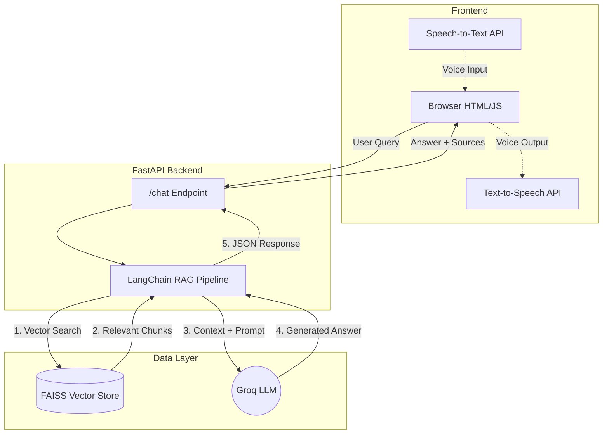

# 🏦 RBI Policy & Union Budget Assistant


An end-to-end Retrieval-Augmented Generation (RAG) system that answers questions strictly grounded in **RBI policy documents** and **Union Budget PDFs**. Built with FastAPI, LangChain, FAISS, and Groq LLMs, it features a lightweight HTML frontend supporting browser-native voice interactions.

---

## 📑 Table of Contents
- [✨ Features](#-features)
- [🏗️ Architecture](#️-architecture)
- [📁 Project Structure](#-project-structure)
- [🚀 Getting Started](#-getting-started)
- [🔁 API Reference](#-api-reference)
- [🧠 Design Rationale](#-design-rationale)
- [🗺️ Roadmap](#️-roadmap)

---

## ✨ Features

- **📄 PDF-Grounded Q&A:** Zero hallucination. Answers are derived strictly from your provided policy documents.
- **🔎 Semantic Search:** Uses FAISS vector similarity to retrieve the most relevant policy chunks in milliseconds.
- **🧠 Ultra-Fast LLM Inference:** Powered by Groq's blazing-fast hosted LLaMA models.
- **🔗 LangChain RAG Pipeline:** Clean separation of ingestion, retrieval, prompting, and generation.
- **🎙️ Voice-Enabled UI:** Browser-native Speech-to-Text and Text-to-Speech (no paid APIs required).

---

## 🏗️ Architecture



---

## 📁 Project Structure

<details>
<summary><b>Click to expand folder structure</b></summary>

```text
rbi-langchain/
├── backend/
│   ├── app/
│   │   ├── main.py              # FastAPI entry point
│   │   ├── api/
│   │   │   └── chat.py          # /chat endpoint
│   │   ├── core/
│   │   │   └── config.py        # Paths, models, env vars
│   │   └── rag/
│   │       ├── ingest.py        # PDF ingestion → FAISS
│   │       ├── retriever.py     # Vector search
│   │       ├── prompts.py       # System & user prompts
│   │       ├── chain.py         # LangChain RAG chain
│   │       ├── graph.py         # (Optional) LangGraph logic
│   │       └── vectorstore.py   # FAISS wrapper
│   └── requirements.txt
├── data/
│   ├── raw/
│   │   ├── rbi/                 # RBI PDFs
│   │   └── budget/              # Union Budget PDFs
│   └── vector_store/            # FAISS index files
├── frontend/
│   └── index.html               # HTML + CSS + JS UI
├── .env                         # Environment variables
├── README.md
└── LICENSE
```
</details>

---

## 🚀 Getting Started

### 1️⃣ Environment Setup
Create a `.env` file in the root directory. Groq is used via LangChain, so you only need the API key.

```env
GROQ_API_KEY=your_groq_api_key_here
```

> **Note:** Never commit your `.env` file. Ensure it is added to your `.gitignore`.

### 2️⃣ Installation

```bash
# Create and activate virtual environment
python -m venv venv
source venv/bin/activate   # Windows: venv\Scripts\activate

# Install dependencies
pip install -r backend/requirements.txt
```

### 3️⃣ Ingest Knowledge Base
Place your PDFs into `data/raw/rbi/` and `data/raw/budget/`. Then, run the ingestion script to chunk the text and build the FAISS index:

```bash
python -m backend.app.rag.ingest
```

### 4️⃣ Run the Application

**Start the Backend:**
```bash
uvicorn backend.app.main:app --reload
```
* API: `http://127.0.0.1:8000/chat`
* Swagger UI: `http://127.0.0.1:8000/docs`

**Start the Frontend:**
Simply open `frontend/index.html` in your favorite web browser.

---

## 🔁 API Reference

### `POST /chat`

**Request Body:**
```json
{
  "query": "What are the major priorities in Union Budget 2026-27?"
}
```

**Response:**
```json
{
  "answer": "The Union Budget 2026–27 emphasizes infrastructure spending, fiscal consolidation, and targeted social welfare schemes...",
  "sources": [
    "Union Budget 2026-27.pdf (Page 12)",
    "Budget Highlights Document.pdf (Page 3)"
  ]
}
```

---

## 🧠 Design Rationale

* **LangChain & Groq:** LangChain abstracts the pipeline orchestration, while Groq provides near-instantaneous inference (ideal for voice-enabled apps where latency breaks UX).
* **Zero-Cost Stack:** By using browser-native Web Speech APIs and local FAISS vector stores, the project avoids the recurring costs associated with cloud TTS/STT and managed vector databases.
* **Framework-less Frontend:** Kept as pure HTML/JS to ensure anyone can spin it up immediately without installing Node.js or running a build step.

---

## 🗺️ Roadmap

- [x] Initial FastAPI & LangChain RAG pipeline setup
- [x] Browser-native Voice UI integration
- [ ] Implement persistent chat history via MongoDB
- [ ] Add multi-agent reasoning paths using LangGraph
- [ ] Build automated policy summary report generation (PDF export)
- [ ] Add authentication and API rate limiting for production
